# 数值分析课程实验 实验报告

```wiki
姓名：高若朋
学号：171860582
邮箱：hellorpg2017@gmail.com
```


## 拟合实验

### 原始数据

根据给出的`.mat`格式文件，通过python的`scipy.io`库进行读入，转变为字典格式之后进行数据提取，找到`PathChan`数据块，提取出`(x,y)`数据表，之后根据坐标做出原始数据的散点图如下：

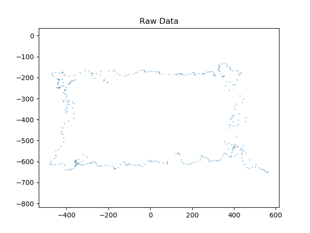

可以从上图中大致看到路径大致为一个四边形。


### 线性拟合

由于线性拟合使用的是直线，所以可以通过原始数据的散点图可以得到，需要四条直线进行拟合。

进一步观察散点图，找到四个拐点。

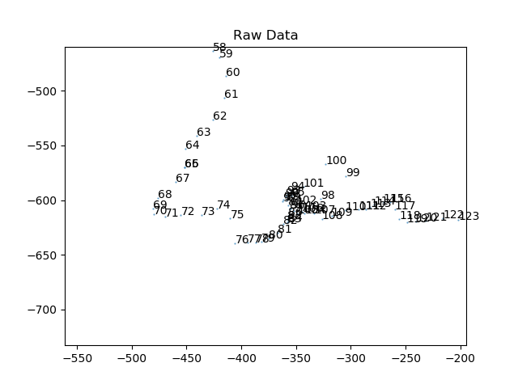

如上图中所示的为左下角的拐点，于是得到了四段线性拟合的分割点如下：

```python
LinearDividePoint = [0, 70, 211, 275, 382]
```

五个点将整个路线分为了四段，分别使用最小二乘法的线性拟合，最后得到的结果为：

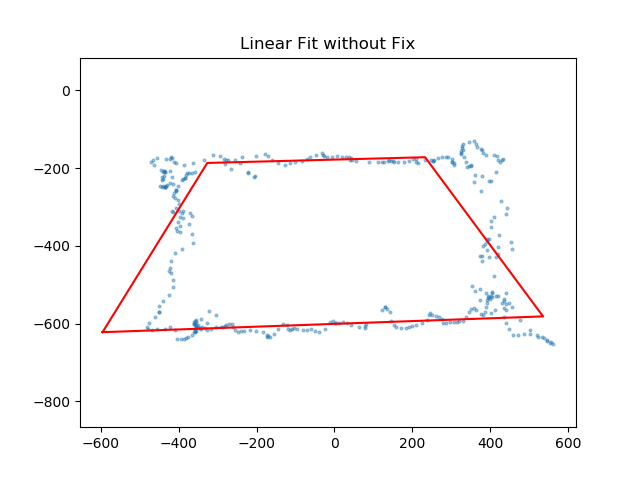

可以看到拟合结果和视觉观感有较大的偏差，所期望的应该是一个接近矩形的四边形而不是一个梯形，存在着明显的误差。

最小二乘法是假设x轴坐标精确，而只对y轴的误差进行了考虑，所以在拟合两个接近垂直的边的时候，由于过分没有考虑x轴的误差，加上直线本就在大斜率的情况下有较大的误差，导致了拟合结果严重偏离了预期的路线。

所以对之前的拟合方法进行修正，在两个垂直边采用xy轴对换的方式进行拟合，减小x轴方向上的误差对拟合结果的影响，得到的结果为：


可以看到最终的拟合结果更加接近视觉观感得到的结果，尤其在两个垂直边有了更好的拟合效果，更加贴近散点，可以明显感觉到这种拟合方式是优于之前的方式的。

同时可以看到，在拟合之后，有些点要比一般的点更加远离拟合结果，就可以考虑他们是误差过大的无效点，去除之后再进行一次拟合。


### 线性拟合+二次拟合

通过观察散点图，可以发现左下和右上两个拐角处有明显的曲线趋势，所以可以考虑在这两个角落不同于整体而使用二次曲线拟合的方法，得到部分区间的拟合曲线。将它与剩下数据的线性拟合直线进行一定的拼接，得到的结果如下：

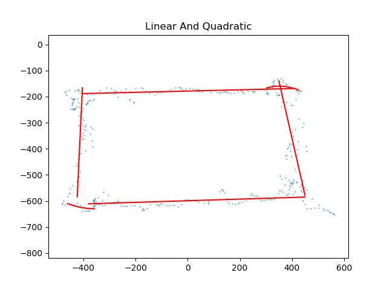

可以看到在两个拐角处确实有了较好的拟合度，但是在每个分段拟合的中间部分却有了一定的断档，所有曲线不能在同时照顾拟合度和平滑性的基础上较好的拼接成为一个整体的封闭曲线，这是这种拟合方式所存在的问题。


### 三次拟合

使用类似的方法，不再在任何一段中使用线性拟合，而是在全局分为四段，使用三次拟合的方法，对数据点进行拟合，之后使用绘图库绘制出的拟合路径如下：

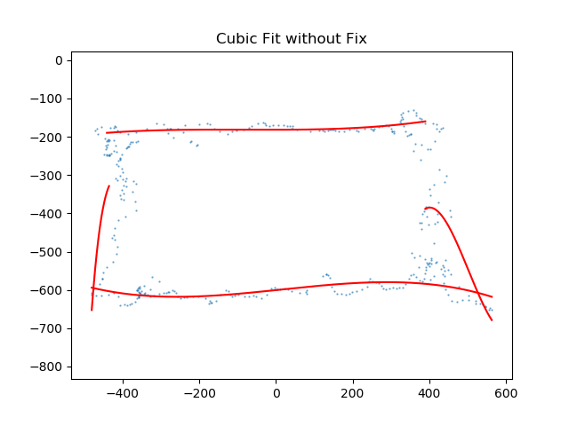

可以看到，出现了和线性拟合不进行修正时一样的问题，在偏向垂直方向的拟合中出现了较大的问题，所以采用了同样的xy轴对换的方法，抵消了在垂直方向上对拟合结果影响过大的误差，最终得到的结果如下：

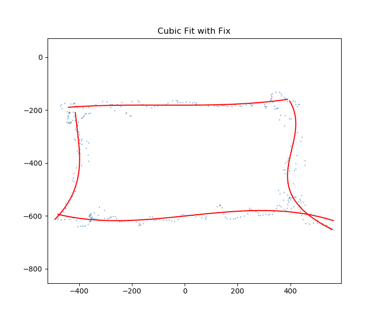

可以看到两侧的拟合曲线有了较大的改变，误差的修复非常的成功。

而对比之前的拟合结果可以发现，三次拟合得到的结果照顾了更多的数据点，也就是说，从视觉观感上来说，三次拟合的结果要优于线性拟合和线性拟合+二次拟合的效果，给人的感觉更加贴近真实的行进路线。

这也复合高次拟合会更加贴近真实路线的预期。


### 四次拟合

拟合结果如下：

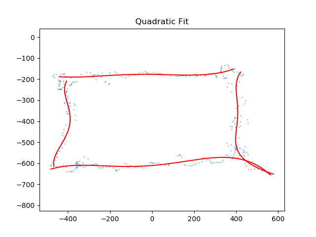

可以看到，拟合结果优于三次拟合，仍然符合次数越高拟合度越高的猜测。


### 高次拟合探究

虽然上述的拟合中，随着次数的增加，拟合度逐渐增加，那我们是否可以说次数越高，拟合度会越好呢？

在实验中，我进行了探究。

`在实验文件中，对应的函数为nFit，对应生成的图也命名为n Fit`

当次数在5次的时候，一切看起来还是那么的正常：

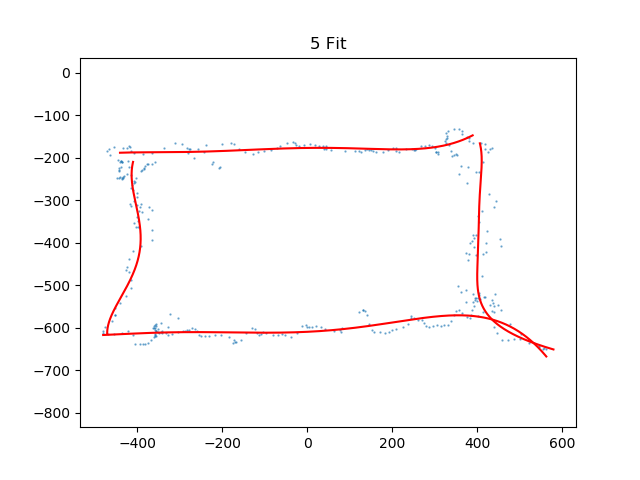

但是到了七次拟合，图形结果就出人意料了，可以说完全不符合预期效果：

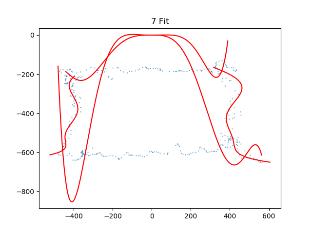

次数继续升高，这种情况并没有好转，反而更加恶劣：

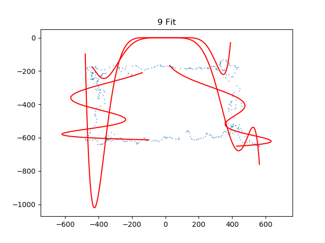

所以可以看到，多次拟合的效果并非次数越高效果越好，甚至可能会适得其反，导致拟合出来的曲线十分扭曲。

如上的对比就是最好的例子。

**所以在进行数据拟合的时候要注意，一味的使用高次拟合是不对的，而是应该根据原始数据点的排布，合理选择相近的次数进行拟合，这样子才能得到更好的拟合效果。**


## 插值实验

### 原始数据

通过一样的方法读入数据，分析数据之后得到未缺失的`(x,y)`数据表，绘制散点图如下，体现了运动的大致轨迹：

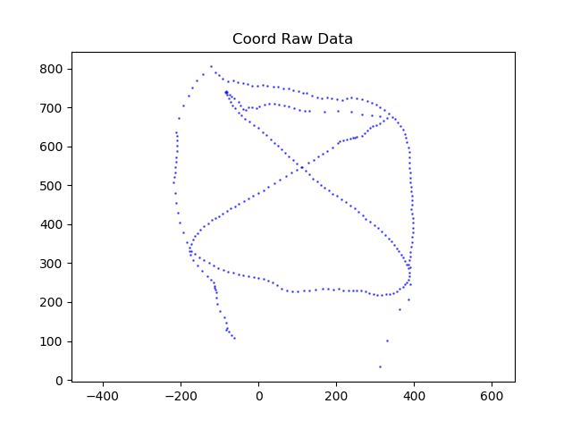


### 分段线性插值

使用分段线性插值，在两个未缺失的数据点之间连接一条直线，根据时间标记和前后两个存在的数据点的x坐标，找到当前缺失坐标时刻的x坐标，将这个x坐标带入线性插值直线，得到一个完整的(x,y)坐标，在散点图中用不同的颜色画出，得到的结果如下：

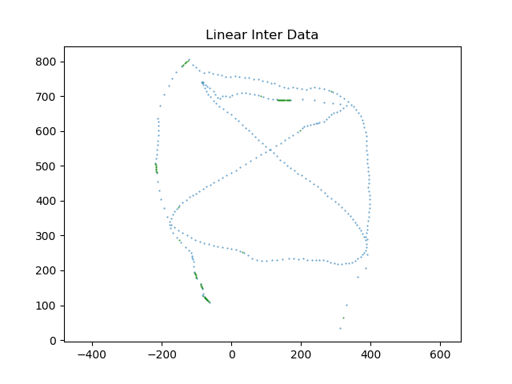

蓝色部分为原始数据，绿色点为插值数据，由于线性插值的特殊性，已经是在两点之间最近的路径上进行插值，单就插值的误差来说可以忽略不计（但是可能存在原始数据点的误差）,而且从整体的观感上这种插值是符合预期的，所以不对插值完成之后的数据点进行二次处理。

通过上述方法，**得到的插值点共计57个**。


### 三次样条插值

单单三次样条插值的话由于方程数小于未知数的数目，所以解不唯一，在插值的时候可以加入自己的额外条件来达到求解唯一结果的目的，这里我选择了自然样条的条件进行计算，通过类似于线性插值的求解步骤，最后得到的插值结果如下：

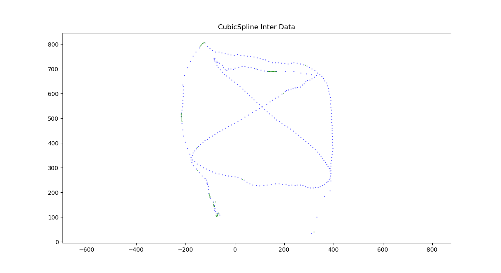

可以看到，三次样条插值在大多数地方得到的结果与分段线性插值是一致的，但是在某些特定的区域得到的结果就有些差强人意：

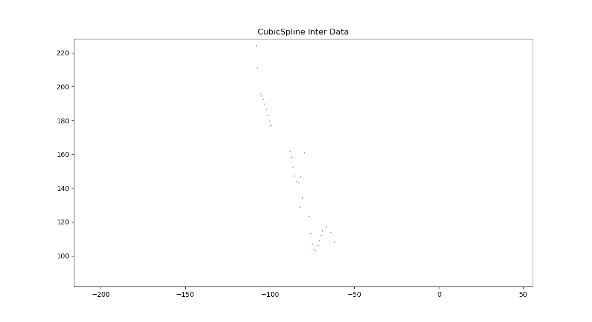

上图为三次样条插值结果的左下角放大图，可以看到这之中的插值结果就出现了和肉眼的较大偏差，尤其是下方的两段明显出现了三次函数的趋势，但是从视觉观感上原本的路线不应该如此复杂，而应该是没有这么多弯折的更圆滑的曲线，同样情况对比一下分段线性插值的结果：

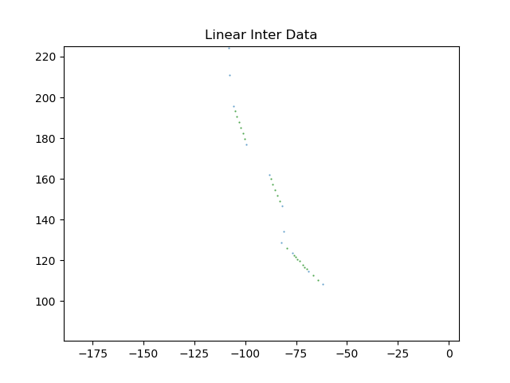

明显在这一段的插值中，线性拟合的观感上的误差更加小，所以可以感觉到，三次样条在这部分的插值效果并没有线性插值好，可以认为在某些特定的数据分布情况下，三次样条可能因为考虑了高次项的运算而导致偏离本来的轨迹，也可能是因为选取参考点的时候没有考虑点的曲折变化影响高次插值的严重程度，也许对原始数据进行一定的屏蔽处理可以得到更好的插值结果。

上述的三次样条法的自然样条插值，最终**得到的插值点共计57个**。


### 误差修正

#### 全局速度修正

通过计算全局的行走速度，找到行走速度的相关数据。

由于插值中，最容易出现偏差的是插值点远离真实路径，所以主要考虑这一种情况，防止插值点过多偏离。所以考虑获取行走速度的MAX值，通过MAX框定所有的插值点距离上一个有效点以及下一个有效点的距离，防止超出可能存在的范围，偏离真实路线。

经过这种修正的插值结果为：

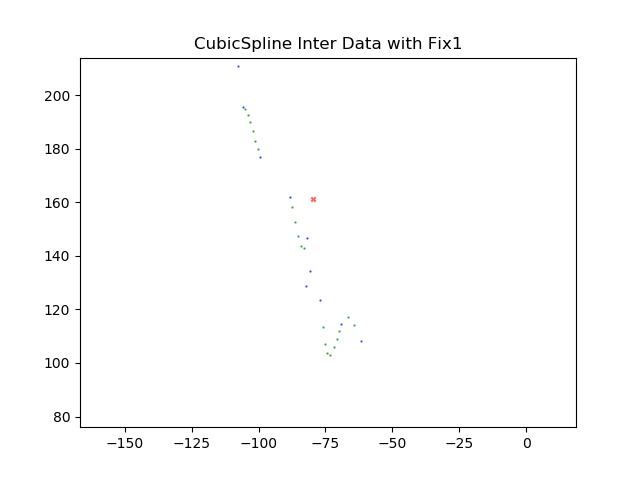

绿色点为插值结果，红色点为经过修正之后去除的插值结果，可以看到有一个明显不符合路线的突兀的插值点被去除。但是仍然有部分过于偏向三次曲线的路线是不合视觉观感的。

另有左侧的结果如下：

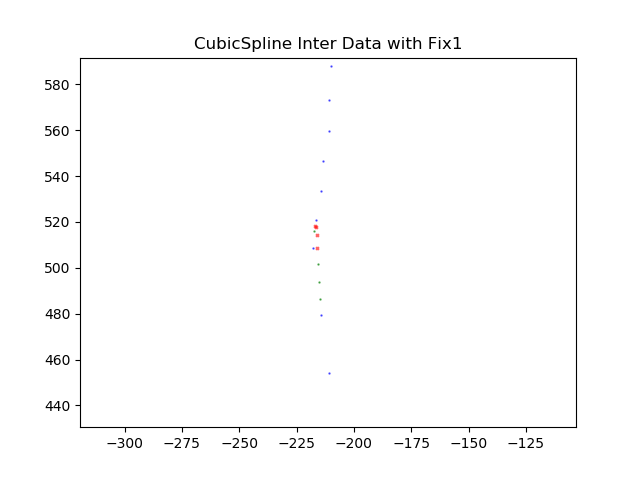

可以看到，确实正确删除了一部分三次曲线中与视觉观感不符合的地方，避免了插值路线太过曲折而偏离真实路线。

全局插值结果如下：

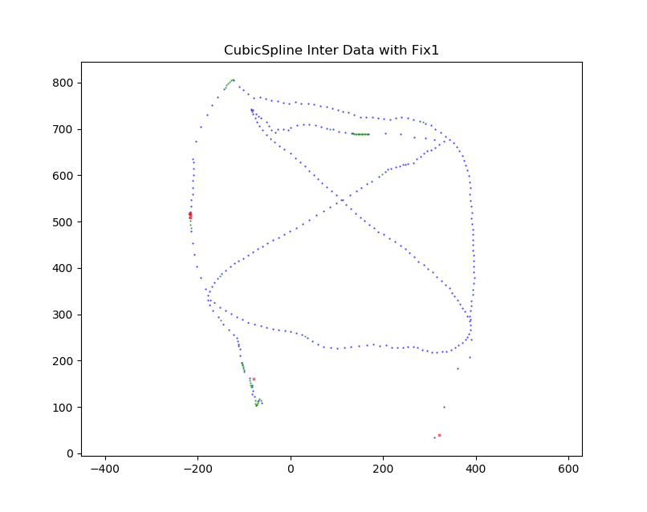

可以看到剩下的修正结果是基本符合视觉观感的。

这种修正方法最终**留下的插值点有51个**。


#### 局部速度修正

给出的数据中人走路的速度并不是相对匀速的，事实上根据计算，平均速度为108左右，而最高速度则有928左右，说明在整个路程中人行走的速度变化是较大的，所以如果用全局的速度进行修正的话，可能会导致较大的误差，因为全局平均速度不能够很好的代表当前插值位置的期望速度。

所以在考虑过后，采用局部的速度计算，来框定插值数据的范围，计算局部的平均速度，记为v，选取可以接受的速度范围为`(0.5v, 2.0v)`，根据这个区间来去除偏离过大的点。

最终的插值结果为：

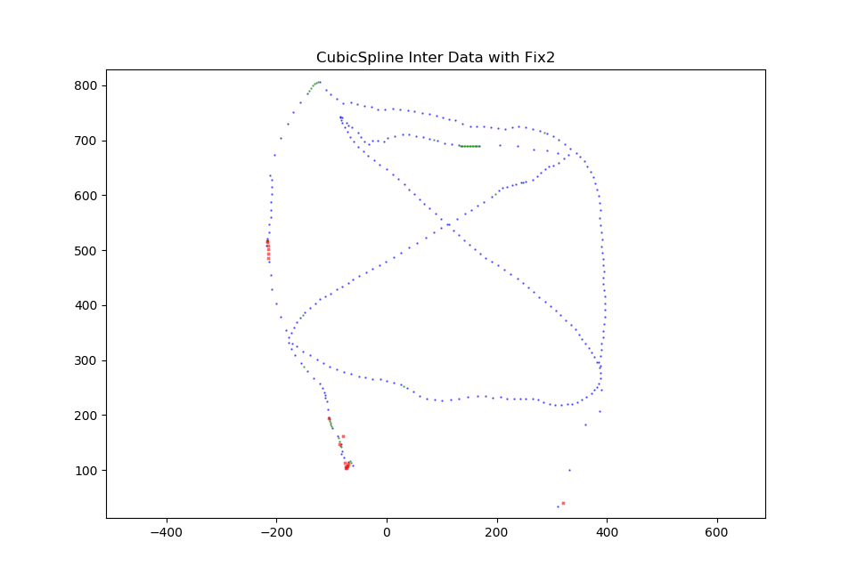

可以看到，去除的点明显要比前面一种更加苛刻，所以最终只**留下了40个插值点**。

其中去除比例最多的是左侧的边路部分和左下角部分：

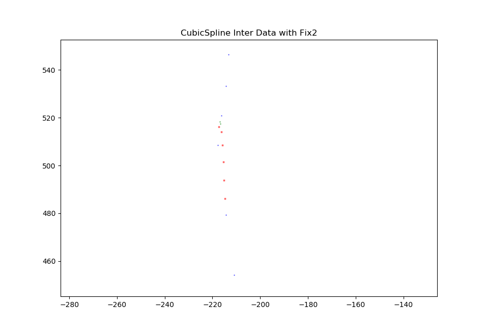

可以看到在这种更加严格的修正法则下，左侧一部分的插值数据几乎被完全舍弃，只留下了“合理”的部分。有同样遭遇的还有左下角的数据：

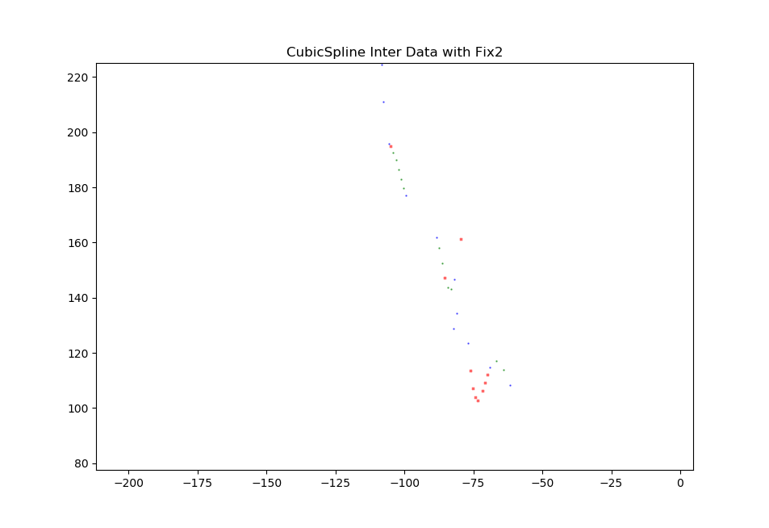

可以看到对于前面所提到的不正常不符合视觉观感的三次曲线形状的插值点，在这次修正中都几乎被去除了，留下来的点中只有少数仍过度向三次函数偏离，大多数的结果都落在了预期范围内。但是代价是舍弃了太多的插值数据点，而导致插值数据不足。


#### 局部速度修正+分段线性补足

根据前面两种修正方法可以看出，修正的严苛性与插值点的保留度是负相关的，既想要更多的修正结果又想要保留更多的点是不可能的一件事情。

所以在这里提出一种想法，在前述的局部速度修正之后，评估每一段保留下的插值点和本应完成的插值点的数目。

如果在当前段落去除了过多的插值点，则放弃三次样条的插值方法，而采用线性插值的方法（偏离小）进行插值，替换掉三次样条得到的结果，最终形成的就是一个三次样条和分段线性插值的综合插值结果，这种结果既尽量使用了曲线插值来还原真实运动轨迹，也保证了有效插值点的数量不会太少，是一种较为优秀的折中办法。

这里由于时间关系，并没有自己实现这一想法，如果后续有更新的实验报告应该会进一步实现。


### 插值评估

关于插值效果的评估，每个人的想法可能都有不同的侧重。

在这里，笔者认为的评估讲就是：

- 速度合理性（这个在前述的误差修正中已经有了体现）
- 路径合理性

所谓速度合理性就是插值出来的数据与原来数据所计算得到的速度是否在合理的速度范围内，也即假设人行走的速度在短时间内不会有巨大的突变。通过这种方法，框定插值点的范围（一个合理的区域内），然后再评估插值点的偏离程度，进行去除或者保留。

而路径合理性并没有在本实验中代码实现，只是提出了一个想法。大概就是根据AI或者其他演算方法，依照人行走的确切数据，对可能的路径进行预估，然后与基础大致的路线，对路线进行估算，然后再与插值点进行比较甚至综合，以此来得到更优的结果。
